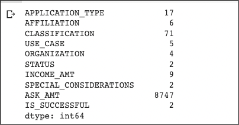
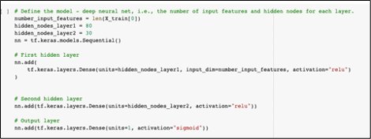
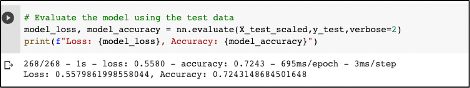
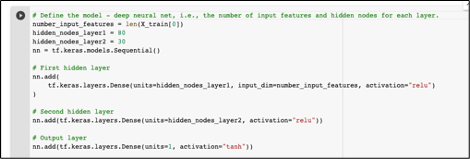
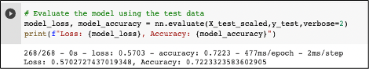
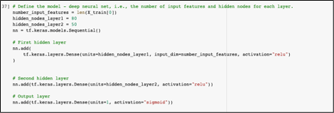
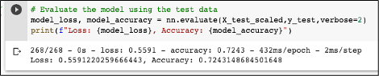
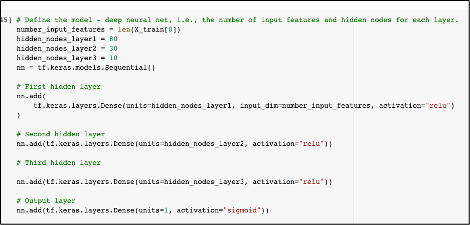
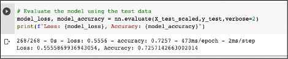

# Neural_Network_Charity-Analysis

## Overview

This analysis implements neural networks using the TensorFlow platform to create a binary classifier that predicts whether recipients of funding from a nonprofit foundation will be successful. The project involved preprocessing data, compiling, training and evaluating the model, and then three attempts at optimizing the model.

## Results

**Data Preprocessing**
* The target variable was the IS_SUCCESSFUL variable.
* The variables, excluding IS_SUCCESSFUL, included in the image below are features in the model.

  
  
* Variables that are neither targets nor features were EIN and Name of the Charity and those were removed from the data set.

**Compiling, Training, and Evaluating the Model**

* I used the model from Deliverable 2 as a starting point to have a baseline to compare the impact of any changes I made on the accuracy.  The neural network model had two hidden layers. The first layer had 80 neurons with a RELU activation. The second layer had 30 neurons with a RELU activation. The output layer had a Sigmoid activation.

  

* The model did not achieve the target of 75% accuracy although came quite close at 72.4%.

  

* I made three attempts to increase model performance.

   -Attempt 1: Changed the activation function on the output layer to tanh
  
    
  
    This resulted in an extremely small increase in accuracy.
  
     

   -Attempt 2: Revereted to original sigmoid function on the output layer and increased the number of neurons on the second hidden layer to 50 
  
     
  
     This resulted in another extremely small increase in accuracy.
  
     
  
  -Attempt 3: Reverted to 30 neurons on the second hidden layer and added a third hidden layer with 10 neurons
  
    
  
    This resulted in another extremely small increase in accuracy.
  
    
  
## Summary

Each change I made in an attempt to optimize the model had little impact on the accuracy. The highest accuracy I was able to achieve was in my third attempt by adding another hidden layer, but the increase was trivial. Neural networks tend to overfit a model so this could explain the lack of accuracy and lack of significant changes when attempting to optimize the model. As such, a better model for this project could be using a Random Forest Algorithm since it will sample the data and build multiple decision trees based on a subset of features. These algorithms can actually rank the importance of the variables and thus remain robust against overfitting. 

